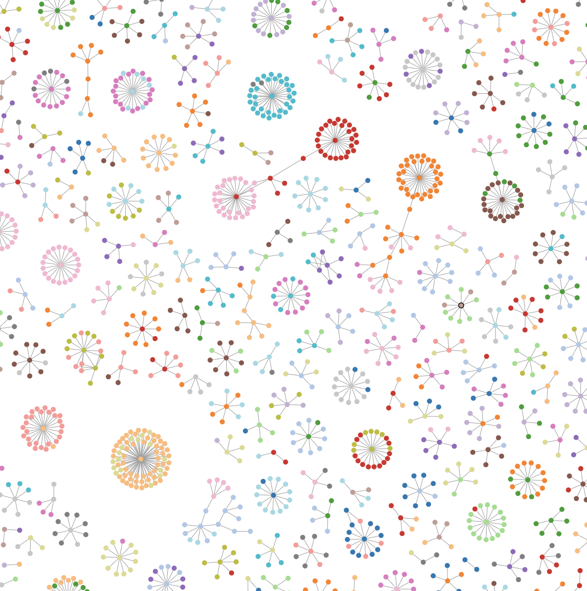

# MSc Thesis 
[https://mscthesis.herokuapp.com/](https://mscthesis.herokuapp.com/) (please, allow a few seconds for the website to load)

## Community Finding (CF) in Phylogenetic Trees using PHYLOViZ Online

The aim of the thesis was to develop an improved version of [PHYLOViZ](http://www.phyloviz.net/) Online by
implementing CF algorithms, as well as, adding new tools for
data visualization. Similar algorithms are being used in other domains. In
phylogenetics, it is a step forward for handling infectious diseases.

This tool is intended to assist distinct health professionals, including doctors and
bioinformaticians, and is designed to enable medical and research purposes.

### Implemented Algorithms

- Louvain;
- Infomap;
- Label propagation;
- Weighted label propagation;
- Layered label propagation.

### Benchmark

- Testing networks: [Stanford Large Network Dataset Collection](http://snap.stanford.edu/data/index.html);
- Congruence calculations: Adjusted Rand and Adjusted Wallace;
- Diversity measures: Simpson's Index of Diversity;
- Speed test: comparison on the time required by each algorithm to return the communities present in a given network.

### Visualization Interface

- [Cytoscape.js](http://js.cytoscape.org/);
- [D3.js (Version 4 & SVG)](https://bl.ocks.org/pkerpedjiev/f2e6ebb2532dae603de13f0606563f5b);
- [D3.js (Version 4 & Canvas)](https://bl.ocks.org/jodyphelan/5dc989637045a0f48418101423378fbd).

### User Guide

1. Insert text file (.txt) with data in this [format](https://github.com/warcraft12321/Thesis/blob/master/uploads/Input.txt) and "Input.txt" name. Or just use the standard file included in the app (for now), in other words, ignore the input field;
2. Choose visualization interface;
3. Choose CF algorithm;
4. Run;
5. Networks above are draggable, zoomable and pannable. 

### Supervision Team

Bruno Gonçalves ([iMM](https://imm.medicina.ulisboa.pt/pt/)) | Alexandre Francisco ([INESC-ID](https://www.inesc-id.pt/) & [IST](https://tecnico.ulisboa.pt/pt/)) | João Carriço ([iMM](https://imm.medicina.ulisboa.pt/pt/) & [IST](https://tecnico.ulisboa.pt/pt/))

### Status

[21/12/18] Louvain algorithm implemented;

[13/01/19] Label Propagation, Weighted Label Propagation and Layered Label Propagation algorithms implemented.

[16/01/19] Infomap algorithm implemented;

[17/01/19] Improved code readability;

[18/01/19] Added compressed algorithms (for enhanced performance) - Credits to [UglifyJS 3](https://skalman.github.io/UglifyJS-online/); 

[19/01/19] Increased code robustness;

[21/01/19] Testing algorithms with big data (1) - Credits to [SNAP](http://snap.stanford.edu/data/index.html#socnets);

[02/02/19] Implemented D3.js (using Canvas and SVG) and Cytoscape.js interface. App deployed to a web server - Credits to [Heroku](https://dashboard.heroku.com/);

[04/02/19] Louvain algorithm bug corrected. Enhanced interface. User is now able to provide input of several parameters;

[Next] Benchmark algorithms;

[Next] PHYLOViZ integration.

### Screenshot

Fig. 1 - Amazon product co-purchasing network (10 000 samples) and detected communities. Using D3.js, SVG and Layered Label Propagation algorithm.
